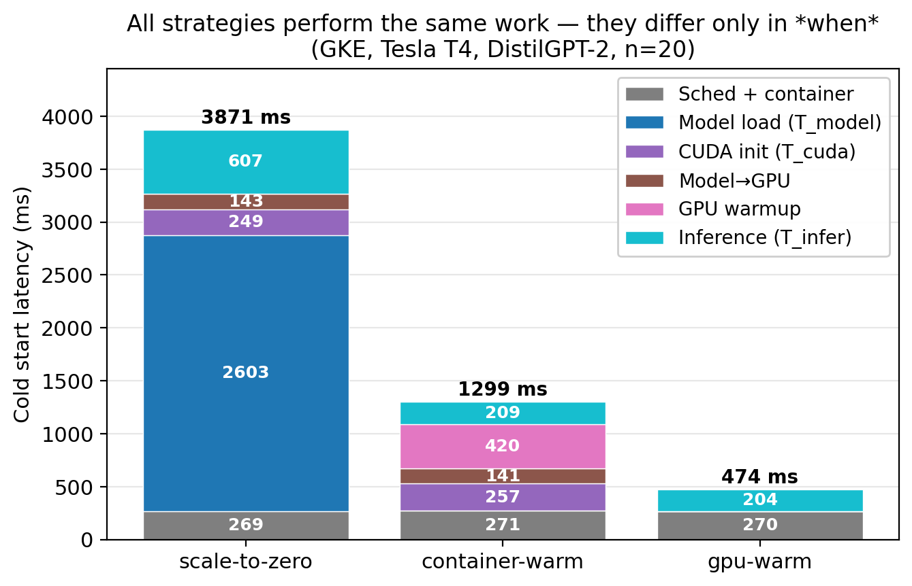
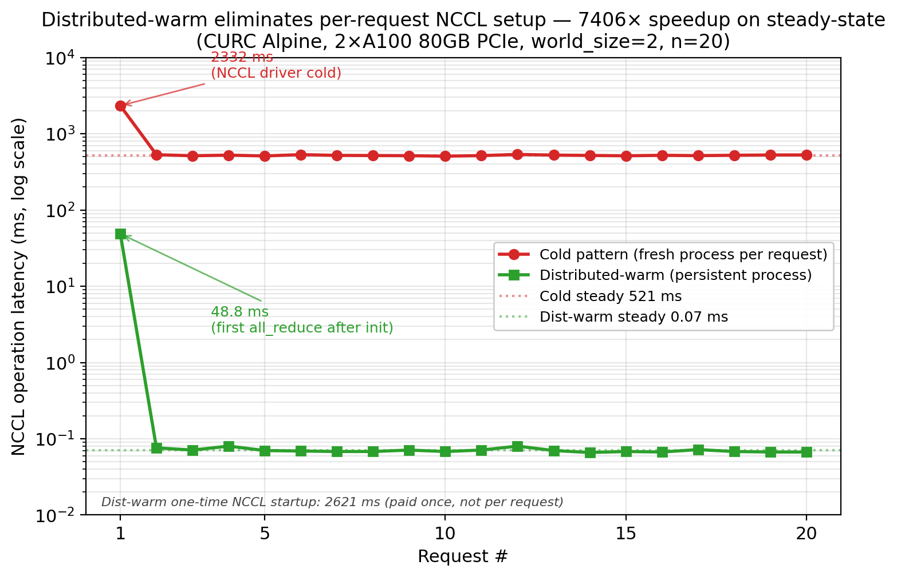

# Cold Start Decomposition for GPU LLM Inference

> Decomposes GPU LLM inference cold start into **6 measured components** across
> two independent deployments (GCP GKE + CURC HPC), evaluates **4 warm-pool
> strategies**, and quantifies the cost–latency tradeoff. Implements and measures
> *distributed-warm* — a **7,406× per-request NCCL speedup** for multi-GPU serving.



---

## The Problem

Scaling AI inference to zero is cost-efficient but introduces **multi-second cold
starts** that wreck p95/p99 latency SLOs. Unlike web services, AI inference cold
starts are *compound*: container init, model weight loading, CUDA context creation,
NCCL communicator setup (multi-GPU), and kernel warmup **all stack on the critical
path**.

Most prior work reports cold start as a single end-to-end number. This project
**decomposes** it into measurable components — so you can see which mitigation
strategy reduces which stage, and what the cost looks like.

## Headline Numbers

| Strategy | Cold p95 | vs scale-to-zero | What's moved out of request path |
|---|---|---|---|
| `scale-to-zero` (baseline) | **4,044 ms** | 1× | nothing |
| `container-warm` | 1,386 ms | **2.9×** faster | T_model |
| `gpu-warm` | 497 ms | **8.1×** faster | T_model + T_cuda + warmup |
| `distributed-warm` † | 0.07 ms / req | **7,406×** faster | T_dist (NCCL communicator) |

† Distributed-warm is measured independently on 2×A100 (`world_size=2`); applies to
multi-GPU tensor-parallel serving. The other three are measured end-to-end on GKE
with DistilGPT-2 on a Tesla T4.

**Cost break-even** (derived): always-on GPU-warm beats scale-to-zero above
**~2.35 req/s** for a Tesla T4 at $0.35/hr.

---

## System Architecture

Two independent, complementary testbeds.

### Setup A — Single-GPU warm-pool comparison (GCP GKE, Tesla T4)

```
   Client (HTTP)
        │
        ▼
   K8s Ingress  ──►  Service  ──►  Deployment (min=0, max=N)
                                         │
                                         │  HPA scales 0 ⇄ N
                                         ▼
                          ┌─────────────────────────────────┐
                          │  FastAPI Pod (1 of 3 warm levels)│
                          │  ────────────────────────────────│
                          │  WARM_LEVEL env var controls:    │
                          │  ┌──────────────────────────────┐│
                          │  │ scale-to-zero │container-warm││
                          │  │               │  + gpu-warm  ││
                          │  └──────────────────────────────┘│
                          │  Per-stage perf_counter timestamps│
                          │  → t_model, t_cuda, t_to_gpu,    │
                          │    t_warmup, t_infer             │
                          └──────────────┬───────────────────┘
                                         ▼
                                NVIDIA Tesla T4 (16 GB)
```

### Setup B — Distributed init (CURC Alpine HPC, 2×A100 80GB PCIe)

```
   sbatch submit_*.sh
        │
        ▼
   Slurm scheduler ──► aa100 partition
                            │
                            ▼
              ┌──────────────────────────────┐
              │  torchrun --nproc-per-node=2 │
              │  ────────────────────────────│
              │  measure_nccl.py    cold pattern (T_dist baseline)
              │  measure_dist_warm.py  warm pattern (request residual)
              └──────────┬───────────────────┘
                         ▼
              2× NVIDIA A100 80GB PCIe (NCCL, NVLink-class allreduce)
```

---

## Tech Stack

| Layer | Technologies |
|---|---|
| **Serving** | FastAPI · Uvicorn · Docker · Kubernetes (GKE) · HPA · NVIDIA T4 |
| **ML runtime** | PyTorch 2.5 (cu121) · HuggingFace Transformers · NCCL 2.x |
| **Distributed** | `torch.distributed` · torchrun · 2× A100 80GB (TP=2 ready) |
| **Orchestration** | Slurm (CURC HPC) · kubectl · `--gres=gpu:N` resource control |
| **Observability** | Per-stage `perf_counter` timing · JSONL append-only event log |
| **Analysis** | NumPy · Matplotlib (5 figures, all reproducible) |
| **Next milestone** | vLLM `--tensor-parallel-size 2` for Llama-3-8B (in progress) |

---

## Quick Reproduction

```bash
make figures      # creates .venv, installs matplotlib, regenerates figures/*.png
```

That's the whole thing for the analysis. Raw trials live in `results/*.jsonl`;
aggregated statistics (mean/p50/p95/p99/stdev) in `results/final_*.json`.

To re-run the experiments themselves see **Reproducing the measurements** below.

---

## Figures

| File | Question it answers |
|------|---------------------|
| [fig1_warmlevel.png](figures/fig1_warmlevel.png) | How much does each strategy cut cold start? |
| [fig2_breakdown.png](figures/fig2_breakdown.png) | Where does cold start time go? (hero figure) |
| [fig3_nccl.png](figures/fig3_nccl.png) | How much overhead does distributed init add? |
| [fig4_cost.png](figures/fig4_cost.png) | When does always-on GPU pay for itself? |
| [fig5_dist_warm.png](figures/fig5_dist_warm.png) | How much does distributed-warm save per request? |



---

## Detailed Results

### Setup A: Scale-to-Zero Baseline (GKE, Tesla T4, n=21 cold / 105 steady)

| Metric | Value |
|--------|-------|
| Cold mean | 3,874 ms |
| Cold p95 | 4,044 ms |
| Steady mean | 389 ms |
| Cold/Steady slowdown | 9.95× |

Component breakdown (where the time goes on a cold request):

| Stage | Field | Mean (ms) | % wall |
|-------|-------|-----------|--------|
| **Model load** | `t_model_ms` | **2,603** | **67.2%** |
| First inference (TTFT) | `t_infer_ms` | 607 | 15.7% |
| Scheduling + container | `t_sched_container_ms` | 269 | 7.0% |
| CUDA init | `t_cuda_ms` | 249 | 6.4% |
| Model → GPU | `t_to_gpu_ms` | 143 | 3.7% |

**Insight**: Model loading dominates at 67% — this is what `container-warm` will
target first.

### Setup A: Container-Warm (n=20 cold / 100 steady)

| Metric | Value |
|--------|-------|
| Cold mean | 1,300 ms |
| Cold p95 | 1,386 ms |
| vs scale-to-zero | **3.0× faster** |

Model load moved to startup → 2,531 ms paid before first request (not counted in
cold wall time). New bottleneck on the request path is GPU warmup (420 ms, 32% of
remaining cold wall time).

### Setup A: GPU-Warm (n=20 cold / 100 steady)

| Metric | Value |
|--------|-------|
| Cold mean | 475 ms |
| Cold p95 | 497 ms |
| vs scale-to-zero | **8.1× faster** |

All initialization moved to startup (~3.25 s pre-paid). Cold request = K8s
scheduling (270 ms) + inference (204 ms) only. Cold/steady ratio drops to 1.24× —
cold becomes essentially indistinguishable from warm.

### Setup A: Three-Way Comparison

| Strategy | Cold mean | Cold p95 | Steady mean | Cold/Steady |
|----------|-----------|----------|-------------|-------------|
| scale-to-zero | 3,873 ms | 4,044 ms | 389 ms | 9.95× |
| container-warm | 1,300 ms | 1,386 ms | 384 ms | 3.38× |
| gpu-warm | 475 ms | 497 ms | 383 ms | 1.24× |

Each strategy progressively moves more work to startup, reducing cold latency at
the cost of higher idle GPU usage.

### Setup B: Distributed Init `T_dist` (2×A100 80GB PCIe, world_size=2, n=20)

Measured via `torchrun measure_nccl.py`. Each trial: fresh process pair →
`init_process_group(backend="nccl")` → `dist.barrier(device_ids=[rank])` →
`torch.cuda.synchronize()`.

| Condition | n | Mean (ms) | p50 | p95 | Note |
|-----------|---|-----------|-----|-----|------|
| First run (driver cold) | 1 | 2,332 | 2,332 | — | CUDA driver + NCCL libs loaded for first time |
| Runs 2–20 (driver warm) | 19 | 521 | 520 | 533 | Pure communicator re-init per process pair |

Cold NCCL init (2,332 ms) is comparable to `T_model` on A100 — making it a
first-class cold start component that **must be addressed for multi-GPU LLM
serving**.

### Setup B: Distributed-Warm Implementation (2×A100, world_size=2, n=20)

The strategy paper Section 4.9 motivates: one long-running 2-process pair calls
`init_process_group` **once at startup**, then services N sequential requests
(each = 1-element `all_reduce` + `cuda.synchronize`). Implementation in
`measure_dist_warm.py`.

| Phase | n | Mean (ms) | p50 | p95 | Note |
|-------|---|-----------|-----|-----|------|
| Startup (one-time) | 1 | 2,621 | — | — | NCCL init paid once |
| Trial 0 (first request) | 1 | 48.8 | — | — | First-touch overhead (kernel cache, allocator) |
| Trials 1–19 (steady) | 19 | **0.07** | 0.069 | 0.080 | Pure communicator reuse |

**Comparison vs cold pattern:**

| Metric | Cold pattern | Distributed-warm | Speedup |
|--------|--------------|------------------|---------|
| Per-request NCCL cost (steady) | 521 ms | 0.07 ms | **7,406×** |
| First request after init | 2,332 ms (cold driver) | 48.8 ms | 48× |

**Production relevance**: In multi-GPU tensor-parallel LLM serving (vLLM, TGI,
TensorRT-LLM), every transformer layer issues an `all_reduce`. Without
distributed-warm, a cold-start pod pays this 521 ms NCCL setup **before serving
the first token**, then continues paying per request if the pod doesn't persist.
This is the throughput cliff that production frameworks like vLLM avoid by
initializing communicators at server startup — confirmed here as a 7,406× per-
request difference.

---

## Repository Layout

```
.
├── server.py                  # FastAPI inference server (GKE deployment)
├── measure_single.py          # Standalone single-GPU cold-start measurement
├── measure_nccl.py            # NCCL cold-pattern measurement (Setup B)
├── measure_dist_warm.py       # NCCL distributed-warm measurement (Setup B)
├── Dockerfile                 # Container image for GCP deployment
├── requirements.txt           # Production deps (torch, transformers, fastapi)
├── requirements-dev.txt       # Plot-only deps (matplotlib, numpy)
├── Makefile                   # `make figures` one-shot reproduction
├── CLAUDE.md                  # Project context for Claude Code agents
├── scripts/
│   ├── make_figures.py        # Generates figures/*.png from results/
│   └── summarize_jsonl.py     # Stats summary (p50/p95/p99) tool
├── submit_coldstart.sh        # Slurm sbatch: NCCL cold-pattern run
├── submit_dist_warm.sh        # Slurm sbatch: distributed-warm run
├── run_all_gcp.sh             # GKE trial driver (3 warm levels × n=20)
├── run_trials.sh              # Single warm-level trial driver
├── results/                   # Raw JSONL + final_*.json summaries
├── figures/                   # Generated PNGs (committed for visibility)
└── report.md                  # Project narrative for course submission
```

---

## Reproducing the Measurements

### Setup A (GKE)

```bash
# Build + push Docker image
docker build -t gcr.io/<PROJECT>/coldstart-distilgpt2:latest .
docker push gcr.io/<PROJECT>/coldstart-distilgpt2:latest

# Deploy three warm-level variants
kubectl create deployment coldstart-scale-to-zero \
  --image=... --env="WARM_LEVEL=scale-to-zero"
# (repeat for container-warm, gpu-warm)

# Drive trials (scales pod to 0 between cold trials)
bash run_all_gcp.sh
```

Server response includes per-stage timings; see API field reference in
[server.py](server.py).

### Setup B (CURC Alpine)

```bash
# Cold pattern (20 fresh process pairs)
sbatch submit_coldstart.sh

# Distributed-warm (1 persistent process pair, 20 requests)
sbatch submit_dist_warm.sh
```

Outputs land in `slurm-<JOBID>.out` plus `results/{nccl,dist_warm}.jsonl`. Both
sbatch scripts target the `aa100` partition with `--gres=gpu:2`. See
[CLAUDE.md](CLAUDE.md) for CURC-specific workflow rules (login vs compute nodes,
fair-share policy, conda activation).

---

## Design Decisions Worth Calling Out

- **Why decompose instead of end-to-end?** End-to-end p95 hides *which* stage
  to optimize. Decomposition reveals model load is 67% of baseline — so
  container-warm (which targets only model load) gives 3× speedup, not 10×.
  The data tells you where to spend engineering effort.

- **Why measure cold *and* distributed-warm separately?** `T_dist` (the paper's
  metric) is the cost of *creating* a NCCL communicator. Distributed-warm
  measures the cost of *using* an already-created one. They answer different
  questions; together they form the argument: "cold = 521 ms × N requests;
  warm = 521 ms once + 0.07 ms × N requests".

- **Why two clusters (GKE + CURC)?** GKE has K8s + HPA but only single-GPU
  T4s available. CURC has 2× A100 nodes with NCCL but no K8s. Each cluster
  answers a question the other can't. The decomposition model makes results
  comparable across both.

- **Why baked-in model weights in the Docker image?** Otherwise `T_model`
  would include HuggingFace Hub download latency (non-deterministic, network-
  dependent). Baking weights into the image isolates "load from local disk"
  as the measurable component.

---

## Future Work

- **TP=2 Llama-3-8B on vLLM**: scale the warm-pool comparison to a real
  production model on 2× A100 with tensor parallelism. Currently in setup
  (Day 4); license + cache + env staging done, measurement next.
- **Burst / Poisson workload**: current measurements use sequential single-
  request pattern. Add bursty traffic (5×–50× peak) to stress how HPA + cold
  start interact under realistic load.
- **vLLM cold start as baseline**: compare custom FastAPI warm-pool against
  out-of-box vLLM serving — quantify the engineering effort delta.
- **K8s events for `T_sched`**: replace the subtract-from-wall-time estimate
  with direct `pod_scheduled → container_started` event-driven measurement.

---

## License

MIT (or whichever applies to course submission).
